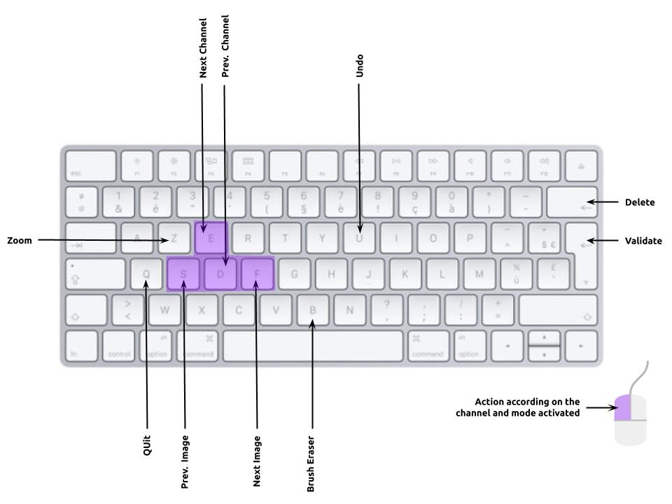

# Interface for manual segmentation
Python interface to manually segment a dataset. In this version, images must be in .jpg format and the target array in the .npy format.


## Download the requirements

```console
foo@bar:~$ pip install -r requirements.txt
```

## Config file description

Build your config.csv file to parameter your different classes

- **class column :** name of the class you want to define
- **bgr_color column :** the color you wnat to display your class in BGR format
- **type column :** the type of drawing 
  - **0 :** draw a polygone area by placing countour points (Then press enter to validate)
  - **1 :** pixel by pixel drawing
  - **2 :** draw filled circles by selecting two point on it
  - **3 or plus :** draw a polygone with defined number of countour points (Automatically validate at the number of points)

My config.csv file to segment a pool table environment is the following

| **class** | **bgr_color**  | **type** |
| :---:   | :-: | :-: |
| Cue Stick | #004080 | 0 |
| Red Ball | #0000FF | 2 |
| Yellow Ball | #00FFFF | 2 |
| Black Ball | #999999 | 2 |

## Run the interface

```console
foo@bar:~$ python manual_segmentation.py train_sample target_sample config.csv
```


## COMMANDS



- **Left button :** reference a point on the current class channel or erase if the brush eraser is activated
- **Enter key :** validate the current references points in the case of type >= 3
- **U key :** undo the last reference point
- **B key:** activate/deactivate the brush eraser
- **E key :** go to the next class channels
- **D key :** go to the previous class channels
- **F key :** go to the next image/target
- **S key :** go to the previous image/target
- **Z key :** navigate between zoom modes (No zoom, x2, x3, x4, x5)
- **Return key :** delete the current sample
- **Q key :** exit the program


