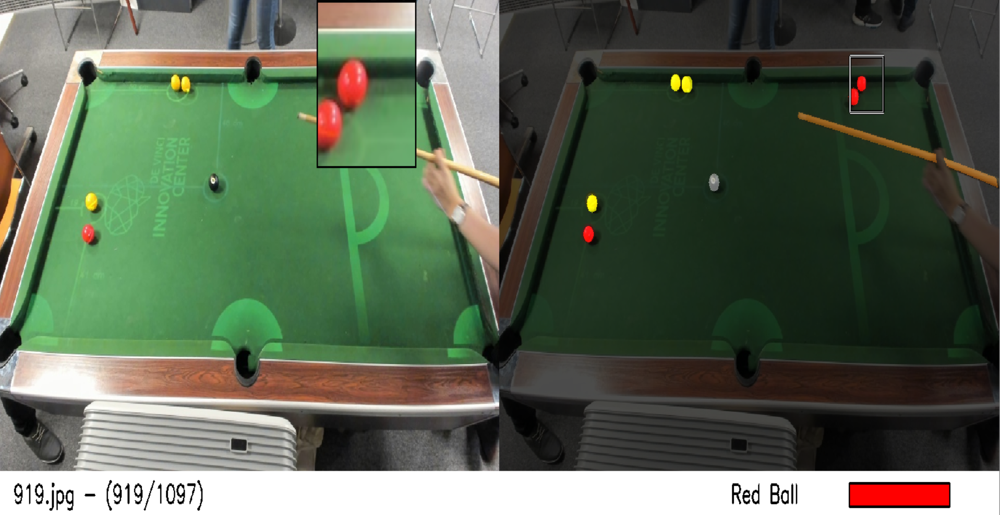

# ManualSegmentationInterface
Python interface to manually segment a dataset. In this version, images must be in .jpg format and the target array in the .npy format.



## Download the requirements

```console
foo@bar:~$ pip install -r requirements.txt
```

## Config file description

Build your config.csv file to parameter your different classes

- class column : name of the class you want to define
- bgr_color column : the color you wnat to display your class in BGR format
- type : the type of drawing 
  - 0 : draw a polygone area by placing countour points (Then press enter to validate)
  - 1 : pixel by pixel drawing
  - 2 : draw filled circles by selecting two point on it
  - 3 or plus : draw a polygone with defined number of countour points (Automatically validate when the number of point reached)

| class | bgr_color  | type |
| :---:   | :-: | :-: |
| Cue Stick | #004080 | 0 |
| Red Ball | #0000FF | 2 |
| Yellow Ball | #00FFFF | 2 |
| Black Ball | #999999 | 2 |

## Run the interface

```console
foo@bar:~$ python manual_segmentation.py train_sample target_sample config.csv
```


## COMMANDS

- Left button pressed on image area : reference a point on the current class channel
- Return button : Undo the last reference point
- Rigth button (kept) pressed : erase with the brush on the current class channel
- Middle mouse scroll : navigate between class channels
- Middle mouse pressed and scroll : navigate between samples
- ← or ↓ arrow : go to the previous sample
- → or ↑ arrow : go to the next sample
- Suppr : Delete the current sample
- Z button : navigate between zoom mode (No zoom, x2, x3, x4, x5)
- Q button : Exit


